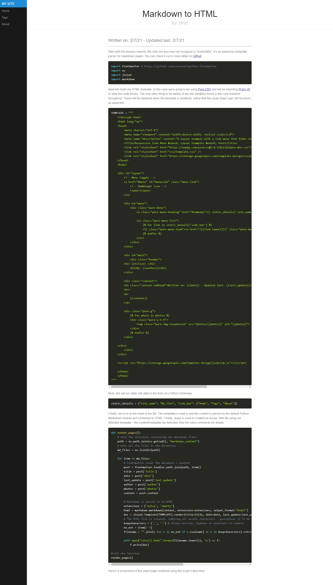

Start with the obvious imports, the only one you may not recognize is "frontmatter," it's an awesome metadata parser for markdown pages. You can check it out in more detail on [Github](https://github.com/eyeseast/python-frontmatter)

```py
import frontmatter # https://github.com/eyeseast/python-frontmatter
import os
import jinja2
import markdown
```

Next lets build our HTML template. In this case were going to be using [Pure CSS](https://purecss.io/) and will be importing [Prism JS](https://prismjs.com/) to style the code blocks. The only other thing to be aware of are the variables found in the curly brackets throughout. These will be repalced when the template is rendered, notice that the usual Jinja2 logic still functions as expected. 

```py
TEMPLATE = """
    <!doctype html>
    <html lang="en">
    <head>
        <meta charset="utf-8">
        <meta name="viewport" content="width=device-width, initial-scale=1.0">
        <meta name="description" content="A layout example with a side menu that hides on mobile, just like the Pure website.">
        <title>Responsive Side Menu &ndash; Layout Examples &ndash; Pure</title>
        <link rel="stylesheet" href="https://unpkg.com/purecss@2.0.5/build/pure-min.css"/>
        <link rel="stylesheet" href="css/template.css" />
        <link rel="stylesheet" href="https://storage.googleapis.com/template-design/css/prism.css" />
    </head>
    <body>

    <div id="layout">
        <!-- Menu toggle -->
        <a href="#menu" id="menuLink" class="menu-link">
            <!-- Hamburger icon -->
            <span></span>
        </a>

        <div id="menu">
            <div class="pure-menu">
                <a class="pure-menu-heading" href="#company">{{ static_details['site_name'] }}</a>

                <ul class="pure-menu-list">
                    
                    <li class="pure-menu-item"><a href="/{{link.lower()}}" class="pure-menu-link">{{link}}</a></li>
                    
                </ul>
            </div>
        </div>

        <div id="main">
            <div class="header">
        <h1> {{title}} </h1>
            <h2>By: {{author}}</h2>
        </div>

        <div class="content">
        <h2 class="content-subhead">Written on: {{date}} - Updated last: {{last_update}}</h2>
        <hr>
        <p>
            {{content}}
        </p>

        <div class="pure-g">
            
            <div class="pure-u-1-4">
                
            </div>
            
        </div>

    </div>
        </div>
    </div>

    <script src="https://storage.googleapis.com/template-design/js/prism.js"></script>

    </body>
    </html>
"""
```

Next, lets set our static site data in the form of a Python Dictionary. 

```py
static_details = {"site_name": "My Site", "side_bar": ["Home", "Tags", "About"]}
```

Finally, we're on to the meat of the file. The metadata is read in and the content is parsed by the default Python Markdown module and converted to HTML. Finally, Jinja2 is used to created an actual .html file using our definded template + the content/metadata we definded. See the inline comments for details. 

```py
def render_pages():
    # Sets the directory containing our markdown files
    path = os.path.join(os.getcwd(), "markdown_content") 
    # Gets all the files in the directory
    md_files = os.listdir(path)

    for item in md_files:
        # Frontmatter reads the metadata + content
        post = frontmatter.load(os.path.join(path, item))
        title = post['title']
        date = post['date']
        last_update = post['last_update']
        author = post['author']
        photos = post['photos']
        content = post.content

        # Markdown is parsed in to HTML
        extensions = ['extra', 'smarty']
        html = markdown.markdown(content, extensions=extensions, output_format='html5')
        doc = jinja2.Template(TEMPLATE).render(title=title, date=date, last_update=last_update, author=author, content=html, static_details=static_details, photos=photos)
        # The HTML file is created, removing all unsafe characters - guarantees it'll be web ready
        keepcharacters = ('_', '-') # Allows periods, hyphens or underbars to remain
        no_ext = item[:-3]
        filename = "".join(c for c in no_ext if c.isalnum() or c in keepcharacters).rstrip()
        
        with open("site/{}.html".format(filename.lower()), 'w') as f:
            f.write(doc)

#call the function
render_pages()
```

Here's a screenshot of this exact page rendered using the script it describes. 


